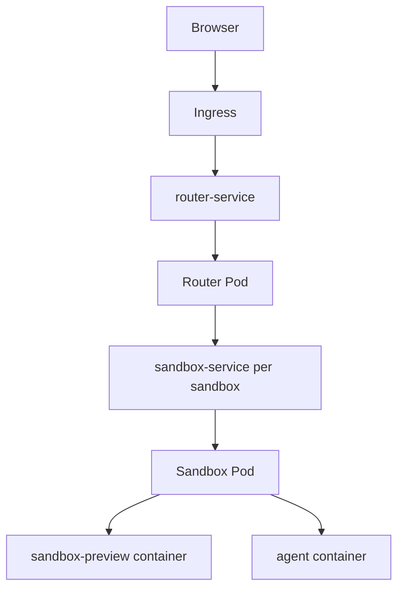
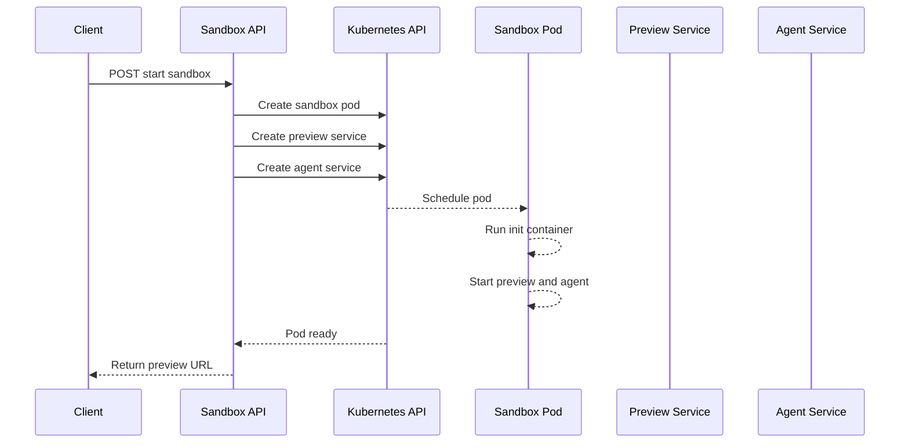
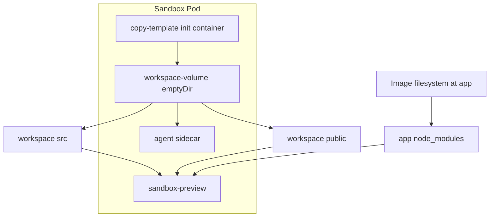
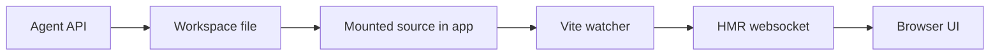
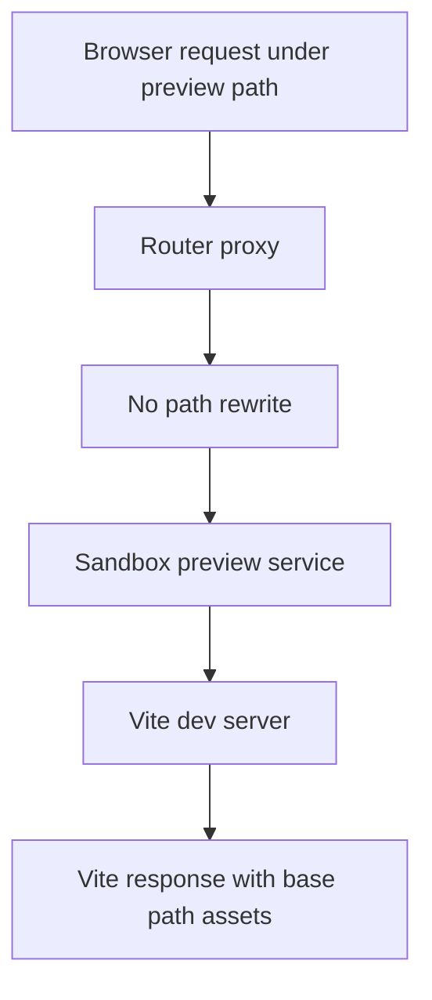
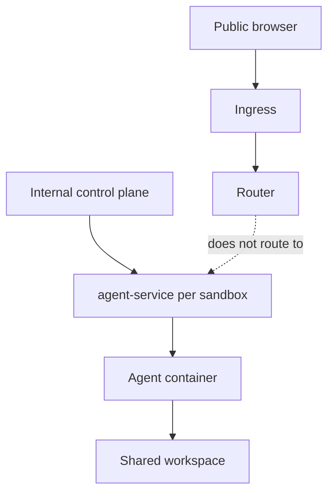

# AGENT_DEVOPS

Deep technical architecture journal for the Kubernetes AI sandbox platform.

This file is the canonical DevOps and infrastructure journal for major changes in Kubernetes, Docker, routing, sandbox preview, shared workspace, agent sidecars, Vite, networking, service discovery, websocket/HMR, deployment, debugging, scaling, and security.

Last updated: 2026-05-19

---

## 1. High-Level Architecture

### Current Platform Shape

The project is a Kubernetes-based AI sandbox platform. A user starts a sandbox through the sandbox API. The API dynamically creates a per-sandbox pod and two per-sandbox services:

- A preview service for browser traffic to the Vite dev server.
- An internal agent service for file editing and future AI APIs.

The sandbox pod contains two long-running containers and one init container:

- `copy-template` init container seeds editable files into the workspace.
- `sandbox-preview` runs the Vite dev server from `/app`.
- `agent` exposes file APIs and edits the shared workspace at `/workspace`.

The important architectural boundary is:

- Docker image filesystem owns dependencies, package metadata, Vite config, and runtime tooling.
- Kubernetes `emptyDir` workspace owns editable project files only.

This avoids copying `node_modules` into a volume, avoids losing `node_modules` behind a mounted directory, and keeps sandbox startup closer to how production-grade browser IDEs separate dependency layers from mutable project state.

### What Changed

The platform moved from a full workspace mount model to a dependency-preserving image model.

Old model:

```txt
template image
   |
   | copies /app into /workspace
   v
/workspace
   includes src, public, package.json, vite.config.js, maybe dependencies

sandbox-preview
   workingDir: /workspace
   runs npm run dev
```

New model:

```txt
template image
   |
   | keeps npm dependencies inside /app/node_modules
   v
/app
   package.json
   package-lock.json
   vite.config.js
   node_modules
   src     <- mounted from shared workspace subPath
   public  <- mounted from shared workspace subPath

/workspace
   src
   public
```

The preview container now runs from `/app`, not `/workspace`. This matters because `npm run dev` resolves the local `vite` binary from `/app/node_modules/.bin/vite`. The editable source directories are mounted into `/app/src` and `/app/public`, so Vite sees live file changes while dependencies remain in the immutable image layer.

### Why The Change Was Needed

The previous architecture caused:

```txt
sh: vite: not found
```

Root cause:

- The preview container ran from `/workspace`.
- `/workspace` was an `emptyDir` volume seeded by an init container.
- The workspace did not contain `node_modules`.
- `npm run dev` looked for `vite` relative to `/workspace`.
- Since `/workspace/node_modules/.bin/vite` did not exist, the shell could not find Vite.

The first workaround was copying more of `/app` into `/workspace`, but that is the wrong long-term design. It slows startup, makes dependency state mutable, risks copying `node_modules`, and blurs the boundary between generated/editable code and runtime dependencies.

The corrected architecture keeps dependencies inside the image and mounts only editable source paths into the image's app directory.

### Previous Architecture

```txt
Browser
   |
   v
Ingress /preview
   |
   v
Router Service
   |
   v
sandbox-service-${sandboxId}
   |
   v
Sandbox Pod
   |
   +-- sandbox-preview
   |      workingDir: /workspace
   |      volumeMount: /workspace
   |      npm run dev
   |
   +-- agent
          workingDir: /workspace
          volumeMount: /workspace
```

Problems:

- Preview container depended on mutable workspace for dependency lookup.
- `node_modules` was not available under `/workspace`.
- Copying the entire template project into `/workspace` mixed dependencies, source, and runtime config.
- Router rewrite behavior fought Vite's configured public base path.

### New Architecture

```txt
Browser
   |
   v
Ingress /preview
   |
   v
Router Service
   |
   v
sandbox-service-${sandboxId}
   |
   v
Sandbox Pod
   |
   +-- initContainer: copy-template
   |      copies /app/src    -> /workspace/src
   |      copies /app/public -> /workspace/public
   |
   +-- container: sandbox-preview
   |      workingDir: /app
   |      runs npm run dev -- --host 0.0.0.0
   |      /app/src    <- workspace subPath src
   |      /app/public <- workspace subPath public
   |      /app/node_modules stays inside image
   |
   +-- container: agent
          workingDir: /workspace
          /workspace <- full workspace mount
          exposes file APIs on port 3000
```

Production implications:

- Faster sandbox startup because dependency install is handled at image build time.
- Cleaner separation between immutable runtime and mutable project state.
- Less filesystem churn inside the shared volume.
- Better debugging because `/workspace` contains only user-editable files.
- Easier cleanup because sandbox state dies with the pod's `emptyDir`.
- More predictable HMR because Vite watches mounted `src` and `public` in its normal project path.

---

## 2. Architecture Diagrams

### Mermaid Diagrams

These Mermaid diagrams intentionally use simple node ids and quoted labels. Keep this style for future edits because it avoids common Mermaid parser issues with slashes, braces, colons, and shell-style variables.

#### Runtime Network



#### Sandbox Startup Flow



#### Pod And Workspace Layout



#### Editable File And HMR Flow



#### No-Rewrite Preview Proxy



#### Internal Agent Service Boundary



### High-Level Runtime

```txt
Browser
   |
   | GET /preview/:sandboxId/
   | GET /preview/:sandboxId/src/main.jsx
   | WS  /preview/:sandboxId/
   v
Ingress
   |
   v
router-service
   |
   v
router pod
   |
   v
sandbox-service-${sandboxId}
   |
   v
sandbox-pod-${sandboxId}
   |
   +-- sandbox-preview :5173
   |
   +-- agent :3000
```

### Kubernetes Object Flow

```txt
POST /api/sandbox/start
   |
   v
sandbox API service
   |
   +-- create pod sandbox-pod-${sandboxId}
   |
   +-- create service sandbox-service-${sandboxId}
   |
   +-- create service agent-service-${sandboxId}
   |
   +-- wait for pod Ready
   |
   v
returns /preview/${sandboxId}/
```

### Pod Layout

```txt
sandbox-pod-${sandboxId}
   |
   +-- volume: workspace-volume
   |      type: emptyDir
   |
   +-- initContainer: copy-template
   |      mount: /workspace
   |      copies only src and public
   |
   +-- container: sandbox-preview
   |      image: template:latest
   |      workingDir: /app
   |      command: npm run dev -- --host 0.0.0.0
   |      port: 5173
   |      mount: /app/src    from workspace subPath src
   |      mount: /app/public from workspace subPath public
   |
   +-- container: agent
          image: agent:latest
          workingDir: /workspace
          command: node /app/server.js
          port: 3000
          mount: /workspace full workspace
```

### Filesystem Ownership

```txt
template image filesystem
   |
   +-- /app/package.json
   +-- /app/package-lock.json
   +-- /app/vite.config.js
   +-- /app/node_modules
   +-- /app/src      <- replaced at runtime by workspace subPath
   +-- /app/public   <- replaced at runtime by workspace subPath

emptyDir workspace
   |
   +-- /workspace/src
   +-- /workspace/public

runtime mount view inside sandbox-preview
   |
   +-- /app/node_modules     from image
   +-- /app/vite.config.js   from image
   +-- /app/src              from emptyDir
   +-- /app/public           from emptyDir
```

### Volume Sharing

```txt
workspace-volume emptyDir
   |
   +-- /workspace/src
   |      |
   |      +-- mounted into sandbox-preview at /app/src
   |      |
   |      +-- visible to agent at /workspace/src
   |
   +-- /workspace/public
          |
          +-- mounted into sandbox-preview at /app/public
          |
          +-- visible to agent at /workspace/public
```

### Agent Editing Flow

```txt
AI agent request
   |
   v
agent-service-${sandboxId}:3000
   |
   v
agent container
   |
   | writes /workspace/src/App.jsx
   v
workspace-volume
   |
   | same file appears as /app/src/App.jsx
   v
sandbox-preview container
   |
   | Vite watcher notices change
   v
Browser updates through HMR
```

### Reverse Proxy Flow

```txt
Browser
   |
   | /preview/abc123/src/main.jsx
   v
Router Express app
   |
   | validates abc123
   | picks proxy for sandbox-service-abc123
   | does not rewrite path
   v
http://sandbox-service-abc123/preview/abc123/src/main.jsx
   |
   v
Vite dev server
   |
   | base is /preview/abc123/
   v
returns transformed JS
```

### WebSocket/HMR Flow

```txt
Browser Vite client
   |
   | WebSocket upgrade under /preview/:sandboxId/
   v
Ingress
   |
   v
router-service
   |
   v
router server upgrade handler
   |
   | extracts sandboxId from request URL
   | forwards upgrade to matching proxy
   v
sandbox-service-${sandboxId}
   |
   v
Vite HMR websocket
```

---

## 3. Code Explanation Section

### Pod Labels

```js
function sandboxLabels(sandboxId) {
    return {
        app: "sandbox-instance",
        sandboxId
    };
}
```

Explanation:

- `app: "sandbox-instance"` gives every dynamic sandbox pod a common identity.
- `sandboxId` differentiates one tenant sandbox from another.
- The pod and both services use the same labels so Kubernetes service selectors find the right pod.
- Production impact: consistent labels are essential for service discovery, debugging, cleanup, metrics, and policy enforcement.

### Shared Workspace Volume

```js
volumes: [
    {
        name: "workspace-volume",
        emptyDir: {}
    }
]
```

Explanation:

- `emptyDir: {}` creates a temporary filesystem for one pod.
- Every container in the pod can mount the same volume.
- The volume appears when the pod is scheduled and disappears when the pod is deleted.
- It is a good fit for ephemeral AI sandbox workspaces because the project can be regenerated per sandbox.
- Production impact: this is simple and fast, but data is not durable. A production system that needs persistence should use PVCs, snapshots, object storage, or workspace export before pod deletion.

### Init Container

```js
initContainers: [
    {
        name: "copy-template",
        image: "template:latest",
        imagePullPolicy: "Never",
        command: [
            "sh",
            "-c",
            "mkdir -p /workspace/src && cp -r /app/src/. /workspace/src/ && mkdir -p /workspace/public && cp -r /app/public/. /workspace/public/ 2>/dev/null || true"
        ],
        volumeMounts: [
            {
                name: "workspace-volume",
                mountPath: "/workspace"
            }
        ]
    }
]
```

Line-by-line reasoning:

- `name: "copy-template"` makes the container's role explicit in pod logs and `kubectl describe`.
- `image: "template:latest"` uses the same image that owns the React/Vite starter files.
- `imagePullPolicy: "Never"` is currently aligned with local kind-style development where images are built locally.
- `command: ["sh", "-c", "..."]` runs a shell script before main containers start.
- `mkdir -p /workspace/src` ensures the subPath target exists before Kubernetes mounts it into `/app/src`.
- `cp -r /app/src/. /workspace/src/` copies only editable source code into the shared workspace.
- `mkdir -p /workspace/public` ensures static assets have a workspace directory.
- `cp -r /app/public/. /workspace/public/ 2>/dev/null || true` copies public assets if present and does not fail the whole pod if `public` is empty or absent.
- Mounting `workspace-volume` at `/workspace` lets the init container seed the same volume later used by preview and agent containers.

The init container deliberately does not copy:

- `node_modules`
- `package.json`
- `package-lock.json`
- `vite.config.js`

Those files remain image-owned under `/app`, which keeps dependency resolution stable.

### Preview Container

```js
{
    name: "sandbox-preview",
    image: "template:latest",
    imagePullPolicy: "Never",
    workingDir: "/app",
    command: ["npm"],
    args: ["run", "dev", "--", "--host", "0.0.0.0"]
}
```

Explanation:

- `name: "sandbox-preview"` identifies this as the browser preview runtime.
- `image: "template:latest"` contains `package.json`, `vite.config.js`, and `node_modules`.
- `workingDir: "/app"` is the key fix for `vite: not found`. It makes `npm run dev` execute in the directory where dependencies exist.
- `command: ["npm"]` and `args: ["run", "dev", "--", "--host", "0.0.0.0"]` start Vite in dev mode and bind it to all interfaces inside the pod.
- `--host 0.0.0.0` is required because Kubernetes services and Codespaces forwarding cannot reach a dev server bound only to localhost.

### Preview Volume Mounts

```js
volumeMounts: [
    {
        name: "workspace-volume",
        mountPath: "/app/src",
        subPath: "src"
    },
    {
        name: "workspace-volume",
        mountPath: "/app/public",
        subPath: "public"
    }
]
```

Explanation:

- The preview container does not mount the whole workspace at `/workspace`.
- `/app/src` is replaced with the editable `src` directory from the shared workspace.
- `/app/public` is replaced with the editable `public` directory from the shared workspace.
- `subPath` prevents the entire volume from hiding `/app`.
- This keeps `/app/node_modules` visible and fixes dependency lookup.
- Production impact: this is the clean separation used by mature browser IDE designs. Dependencies are in immutable layers, source files are mutable.

### Preview Environment

```js
env: [
    {
        name: "VITE_BASE",
        value: `/preview/${sandboxId}/`
    },
    {
        name: "CHOKIDAR_USEPOLLING",
        value: "true"
    },
    {
        name: "CHOKIDAR_INTERVAL",
        value: "100"
    }
]
```

Explanation:

- `VITE_BASE` tells Vite that all browser-visible assets live under `/preview/:sandboxId/`.
- This makes generated HTML contain paths like `/preview/:sandboxId/src/main.jsx`.
- `CHOKIDAR_USEPOLLING=true` improves file watching reliability on mounted volumes.
- `CHOKIDAR_INTERVAL=100` controls polling frequency. Lower intervals improve responsiveness but cost more CPU.
- Production impact: polling should be tuned carefully at scale because hundreds of sandboxes can multiply filesystem watcher cost.

### Agent Container

```js
{
    name: "agent",
    image: "agent:latest",
    workingDir: "/workspace",
    command: ["node"],
    args: ["/app/server.js"],
    env: [
        {
            name: "WORKSPACE_DIR",
            value: "/workspace"
        }
    ],
    volumeMounts: [
        {
            name: "workspace-volume",
            mountPath: "/workspace"
        }
    ]
}
```

Explanation:

- The agent is a sidecar because it must operate on the same live filesystem as the preview container.
- `workingDir: "/workspace"` makes file operations naturally relative to the editable project.
- The agent runs from `/app/server.js`, so the agent's own dependencies remain in its image.
- `WORKSPACE_DIR=/workspace` gives the agent API one root directory to protect.
- The full workspace mount is correct for the agent because it needs to inspect and edit all user files.
- Production impact: the agent is internal-only and should not be exposed through public ingress.

### Preview Service

```js
export async function createPreviewService(sandboxId) {
    const serviceManifest = createServiceManifest({
        name: `sandbox-service-${sandboxId}`,
        sandboxId,
        ports: [
            {
                port: 80,
                targetPort: 5173,
                protocol: "TCP",
                name: "preview-http"
            }
        ]
    });
}
```

Explanation:

- `sandbox-service-${sandboxId}` gives each sandbox a stable DNS name.
- `port: 80` gives the router a simple HTTP target.
- `targetPort: 5173` routes to Vite inside the pod.
- The selector uses `app: sandbox-instance` and `sandboxId`, so only the matching pod receives traffic.

### Agent Service

```js
export async function createAgentService(sandboxId) {
    const serviceManifest = createServiceManifest({
        name: `agent-service-${sandboxId}`,
        sandboxId,
        ports: [
            {
                port: 3000,
                targetPort: 3000,
                protocol: "TCP",
                name: "agent-http"
            }
        ]
    });
}
```

Explanation:

- The agent has a separate service so internal systems can call it without mixing agent traffic into the preview router.
- It stays ClusterIP and is not exposed through ingress.
- Production impact: keeping the agent internal reduces the public attack surface and keeps user-facing routing simpler.

### Router Proxy

```js
const target = `http://sandbox-service-${sandboxId}/preview/${sandboxId}`;

createProxyMiddleware({
    target,
    changeOrigin: true,
    ws: true,
    xfwd: true,
    on: {
        error(error, req, res) {
            // error handling
        }
    }
});
```

Explanation:

- The target points to the per-sandbox preview service.
- The target includes `/preview/${sandboxId}` because Vite has been configured with the same base path.
- No `pathRewrite` is used. This is critical. Vite generated paths already include `/preview/:sandboxId/`, so stripping the path would produce requests that no longer match Vite's configured public base.
- `changeOrigin: true` rewrites the Host header for the upstream service.
- `ws: true` enables websocket proxying for Vite HMR.
- `xfwd: true` adds forwarded headers such as `X-Forwarded-For`, useful for logs and upstream awareness.
- Production impact: no-rewrite proxying keeps browser URLs, Vite base paths, and upstream request paths aligned.

### WebSocket Upgrade Handling

```js
server.on("upgrade", handlePreviewUpgrade);
```

Explanation:

- Express middleware is not always enough for websocket upgrades.
- The HTTP server emits an `upgrade` event when the browser starts a websocket connection.
- The router extracts the sandbox id from the URL and forwards the upgrade to the correct per-sandbox proxy.
- This is needed for Vite HMR to work reliably through the router.

### Vite Config

```js
export default defineConfig({
  plugins: [react()],
  base: process.env.VITE_BASE || "/",
  server: {
    host: "0.0.0.0",
    port: 5173,
    strictPort: true,
    hmr: true,
    allowedHosts: true,
    watch: {
      usePolling: true,
      interval: 100
    }
  }
});
```

Explanation:

- `base` controls browser-visible asset URLs.
- `process.env.VITE_BASE` lets each sandbox get a dynamic base path.
- The fallback `/` keeps local development normal when not running through `/preview/:sandboxId/`.
- `host: "0.0.0.0"` is required for Kubernetes service routing.
- `port: 5173` matches the preview service target.
- `strictPort: true` prevents Vite from silently choosing a different port and breaking service routing.
- `hmr: true` keeps live updates enabled.
- `allowedHosts: true` avoids host header rejection when traffic comes through Codespaces, ingress, or the router.
- Polling watch settings make changes in mounted volumes visible to Vite.

### Agent APIs

```js
app.get("/files", async (req, res) => { ... });
app.get("/read", async (req, res) => { ... });
app.post("/write", async (req, res) => { ... });
app.post("/create", async (req, res) => { ... });
```

Explanation:

- `/files` lists workspace entries for file explorer behavior.
- `/read` reads a single file under `/workspace`.
- `/write` writes a file and creates parent directories.
- `/create` creates files or directories and can protect against overwriting existing files.
- All paths are resolved through `resolveWorkspacePath`, which prevents path traversal outside `/workspace`.
- Production impact: this path boundary is security-critical because agent APIs operate on the filesystem.

### Dockerfile: Template

```dockerfile
FROM node:20-alpine
WORKDIR /app
COPY package*.json ./
RUN npm install
COPY . .
EXPOSE 5173
CMD ["npm", "run", "dev", "--", "--host", "0.0.0.0"]
```

Explanation:

- `WORKDIR /app` is where dependencies and Vite config live.
- `COPY package*.json ./` allows Docker to cache dependency installation.
- `RUN npm install` installs Vite and React inside the image.
- `COPY . .` copies source and config into the image so the init container can seed source files.
- `EXPOSE 5173` documents the Vite port.
- The runtime command starts Vite in dev mode.

Production note:

- For reproducibility, `npm ci` is usually preferred over `npm install` when `package-lock.json` exists.
- For local learning and iteration, `npm install` is acceptable, but production image builds should be pinned and repeatable.

---

## 4. Debugging Journey

### Issue: `vite: not found`

Symptom:

```txt
sh: vite: not found
```

Root cause:

- The preview container ran from `/workspace`.
- `npm run dev` resolves binaries from the current project's `node_modules/.bin`.
- `/workspace` was a fresh `emptyDir`, not the Docker image's `/app`.
- The init container copied source/config but did not provide `node_modules`.

Wrong assumption:

- Copying the full app into `/workspace` looked like it would make the workspace self-contained.
- In practice, copying dependencies into runtime volumes is slow, fragile, and not how this architecture should work.

Final solution:

- Keep dependencies in `/app/node_modules`.
- Run preview from `/app`.
- Mount only editable directories from `/workspace` into `/app/src` and `/app/public`.

### Issue: Vite Base Path Warning

Symptom:

```txt
The server is configured with a public base URL...
```

Root cause:

- Vite was configured with `base: /preview/:sandboxId/`.
- The browser correctly requested `/preview/:sandboxId/src/main.jsx`.
- The router stripped `/preview/:sandboxId` before forwarding to Vite.
- Vite received `/src/main.jsx`, which did not match the configured public base.

Final solution:

- Remove `pathRewrite`.
- Keep upstream requests under `/preview/:sandboxId/...`.
- Keep `VITE_BASE=/preview/:sandboxId/`.

### Issue: Services Could Not Find Pods

Root cause:

- Pod labels and service selectors did not consistently match.

Final solution:

```js
labels: {
    app: "sandbox-instance",
    sandboxId
}

selector: {
    app: "sandbox-instance",
    sandboxId
}
```

Production implication:

- Label consistency is a hard requirement for dynamic service discovery. A wrong selector is equivalent to a service with no endpoints.

### Issue: HMR Through Router

Root cause:

- Vite HMR uses websocket upgrade requests.
- Express middleware can handle many proxy cases, but direct HTTP server upgrade handling is more reliable.

Final solution:

- Keep `ws: true` in proxy middleware.
- Add `server.on("upgrade", handlePreviewUpgrade)`.
- Extract `sandboxId` from the upgrade URL and route to the correct proxy.

---

## 5. Kubernetes Concepts Learned

### Pod

In this project, a pod is the sandbox boundary. The preview container and agent container live together because they need shared filesystem access and a shared lifecycle. If the pod dies, the sandbox dies.

### Service

Services give dynamic pods stable DNS names. The router does not need pod IPs. It targets names like:

```txt
sandbox-service-${sandboxId}
```

Kubernetes resolves that name to the correct pod endpoints through labels and selectors.

### ClusterIP

ClusterIP services are internal to the cluster. That is exactly right for preview and agent services. The browser reaches preview through ingress and router, not directly.

### DNS

Kubernetes DNS lets the router call:

```txt
http://sandbox-service-${sandboxId}
```

without knowing where the pod is scheduled.

### Sidecar

The agent is a sidecar because it supports the sandbox-preview container without being the preview runtime itself. It edits the same workspace that Vite watches.

### Init Container

The init container prepares the workspace before Vite starts. That avoids race conditions where Vite starts before `src` exists.

### Volume Mounts

The project uses volume mounts surgically:

- Full mount for agent at `/workspace`.
- SubPath mounts for preview at `/app/src` and `/app/public`.

This is the core architecture decision that preserves dependencies while still allowing edits.

### emptyDir

`emptyDir` is ephemeral sandbox state. It is fast, local to the pod, and automatically cleaned up with the pod.

### Port Forward

Port forwarding is useful for debugging a service or pod directly:

```bash
kubectl port-forward service/router-service 3000:80
kubectl port-forward service/sandbox-service-${sandboxId} 5173:80
```

This bypasses ingress and helps isolate whether bugs live in router, ingress, service discovery, or Vite.

### Readiness

The sandbox API waits for the pod Ready condition. That means `/start` should not return a preview URL until Kubernetes reports the containers are ready.

### WebSocket Proxying

HMR is not just HTTP. The router must proxy websocket upgrades to the same sandbox preview service. Without this, initial page load can work while live reload fails.

---

## 6. Docker Concepts Learned

### Image Layering

The template Dockerfile copies package files first, installs dependencies, then copies the rest of the project. This lets Docker cache dependency installation when source files change but dependencies do not.

### Dependency Management

Dependencies belong in the image:

```txt
/app/node_modules
```

Editable files belong in the workspace:

```txt
/workspace/src
/workspace/public
```

This separation avoids slow startup and runtime dependency drift.

### Runtime vs Build State

Build-time state:

- `node_modules`
- Vite binary
- React packages
- base project configuration

Runtime mutable state:

- user-edited source files
- generated components
- public assets

### Why `node_modules` Should Stay Inside Image

If `node_modules` is copied into a workspace volume:

- startup becomes slower
- the volume becomes large
- dependency state becomes mutable
- cleanup becomes expensive
- file watchers may scan too much

When it stays in the image:

- startup is predictable
- Vite is always available
- each sandbox gets the same dependency baseline

### Why Editable Files Stay In Shared Workspace

The agent and Vite need to see the same source files. The shared volume gives both containers the same live file tree while preserving separate runtime responsibilities.

---

## 7. Request Lifecycle

### Sandbox Startup Lifecycle

```txt
Client
   |
   | POST /api/sandbox/start
   v
sandbox API
   |
   | create sandbox id
   v
Kubernetes API
   |
   | create pod
   | create preview service
   | create agent service
   v
Pod init
   |
   | copy template src/public to workspace
   v
Preview + agent containers start
   |
   v
sandbox API waits for Ready
   |
   v
Client receives /preview/:sandboxId/
```

### Browser Preview Lifecycle

```txt
Browser Request
   |
   | GET /preview/:sandboxId/
   v
Ingress
   |
   v
Router Service
   |
   v
Router Proxy
   |
   | no path rewrite
   v
Sandbox Preview Service
   |
   v
Vite Server in sandbox-preview
   |
   v
React App
```

Detailed step flow:

1. Browser requests `/preview/:sandboxId/`.
2. Ingress routes `/preview` to `router-service`.
3. Router validates `sandboxId`.
4. Router selects or creates a cached proxy for that sandbox.
5. Router forwards the original base-path request to `sandbox-service-${sandboxId}`.
6. Kubernetes service routes port 80 to pod port 5173.
7. Vite receives a request under `/preview/:sandboxId/`, matching `VITE_BASE`.
8. Vite returns HTML with `/preview/:sandboxId/@vite/client` and `/preview/:sandboxId/src/main.jsx`.
9. Browser requests those URLs through the same router path.
10. Vite serves transformed JS and HMR client code.

### File Edit Lifecycle

```txt
Agent API call
   |
   v
agent container
   |
   | writes /workspace/src/App.jsx
   v
emptyDir volume
   |
   | same file mounted as /app/src/App.jsx
   v
Vite watcher
   |
   v
HMR websocket
   |
   v
Browser updates
```

---

## 8. Infrastructure Decisions

### Why Agent Sidecar Exists

The agent must edit files that Vite can immediately serve. A sidecar in the same pod is the simplest way to share a live filesystem without external storage or synchronization protocols.

### Why Preview And Agent Services Are Separate

Preview traffic is browser-facing. Agent traffic is internal control-plane traffic. Mixing them creates security and routing confusion. Separate services allow different policies later:

- public preview route
- internal-only agent route
- separate authentication
- separate rate limits
- separate network policies

### Why Reverse Proxy Is Needed

The browser needs one stable entrypoint. Dynamic sandbox services are created per sandbox, but the browser should not know cluster DNS names. The router translates `/preview/:sandboxId/` into the correct internal service.

### Why Dynamic Sandbox Services Are Used

Each sandbox pod gets a dedicated service so routing is stable even if pod IPs change. This is the Kubernetes-native way to route to dynamic workloads.

### Why Vite Base Path Is Required

The preview is not served at `/`. It is served at:

```txt
/preview/:sandboxId/
```

Vite must generate asset and HMR URLs under that path, otherwise the browser requests `/src/main.jsx` from the platform root and misses the router context.

### Why Router Must Not Rewrite Vite Paths

Once Vite knows the base path, the upstream dev server expects to receive requests under that same base. Rewriting `/preview/:sandboxId/src/main.jsx` to `/src/main.jsx` makes Vite complain because the request no longer matches its public base.

---

## 9. Production Engineering Notes

### Scaling Implications

Each sandbox creates:

- one pod
- one preview service
- one agent service
- one `emptyDir`

At small scale this is simple. At larger scale, watch for:

- service count limits
- DNS churn
- pod scheduling latency
- image pull latency
- filesystem watcher CPU from polling
- memory pressure from many Vite dev servers

### Security Considerations

Important hardening steps:

- Keep agent service internal.
- Add authentication for agent APIs before exposing them to any user-facing control plane.
- Enforce path traversal protection for all file APIs.
- Consider Kubernetes NetworkPolicies to restrict who can reach `agent-service-*`.
- Set resource requests and limits per sandbox.
- Consider pod security settings such as non-root users, read-only root filesystem where possible, and dropped capabilities.
- Add cleanup for abandoned sandboxes.

### Multi-Tenant Isolation

Current isolation is pod-level. Stronger isolation may require:

- separate namespaces per user or session
- network policies
- runtime sandboxing
- restricted service accounts
- CPU and memory quotas
- workspace persistence boundaries

### Performance Concerns

Vite dev servers are memory-heavy compared with static previews. HMR and polling watchers cost CPU. The system should eventually track:

- pod startup time
- Vite ready time
- HMR latency
- agent write latency
- router proxy latency
- per-sandbox CPU/memory usage

### Cleanup Strategy

Every sandbox should eventually have cleanup logic:

```txt
delete pod sandbox-pod-${sandboxId}
delete service sandbox-service-${sandboxId}
delete service agent-service-${sandboxId}
```

If persistence is added, cleanup must also decide whether to archive, snapshot, or delete workspace state.

### WebSocket Limitations

Websockets need support across:

- browser
- Codespaces forwarding
- ingress controller
- router service
- Express server upgrade handler
- proxy middleware
- Vite server

One broken hop can make HMR fail while normal HTTP still works.

### GitHub Codespaces Proxy Limitations

Codespaces requires services to bind to `0.0.0.0`. Binding to `localhost` inside a container often works only from inside that container, not through Kubernetes service routing or external forwarding.

---

## 10. Command Journal

### Build Router Image

```bash
docker build -t router:latest -f sandbox/router/dockerfile sandbox/router
```

What it does:

- Sends `sandbox/router` as Docker build context.
- Uses the router Dockerfile.
- Installs router dependencies.
- Produces the `router:latest` image used by the router deployment.

Current known issue:

- Docker Desktop Linux engine was not reachable during the last attempt from this machine.

### Load Router Image Into kind

```bash
kind load docker-image router:latest
```

What it does:

- Copies the locally built image into kind node image storage.
- Required when `imagePullPolicy: Never` or local images are used.

Current known issue:

- `kind` was not available in PATH during the last command check.

### Restart Router Deployment

```bash
kubectl rollout restart deployment/router-deployment
```

What it does:

- Tells Kubernetes to restart router pods.
- New pods use the locally available `router:latest` image.

### Watch Router Rollout

```bash
kubectl rollout status deployment/router-deployment
```

What it does:

- Waits until the deployment finishes replacing old pods with new ones.

### Create Sandbox

```bash
curl -X POST http://localhost:<api-port>/api/sandbox/start
```

What it does:

- Calls sandbox API.
- Triggers pod and service creation.
- Returns sandbox id and preview URL.

### Inspect Dynamic Objects

```bash
kubectl get pods -l app=sandbox-instance
kubectl get svc
kubectl describe pod sandbox-pod-${sandboxId}
kubectl get endpoints sandbox-service-${sandboxId}
```

What these commands verify:

- The pod exists.
- Services exist.
- Service endpoints point to the sandbox pod.
- Init container completed.
- Preview and agent containers are running.

### Inspect Workspace

```bash
kubectl exec -it sandbox-pod-${sandboxId} -c agent -- ls -la /workspace
kubectl exec -it sandbox-pod-${sandboxId} -c agent -- ls -la /workspace/src
kubectl exec -it sandbox-pod-${sandboxId} -c sandbox-preview -- ls -la /app
kubectl exec -it sandbox-pod-${sandboxId} -c sandbox-preview -- ls -la /app/node_modules/.bin
```

What these commands verify:

- Agent sees editable workspace.
- Preview sees `/app/node_modules`.
- Preview sees source through `/app/src`.
- Vite binary exists in the image dependency layer.

### Check Logs

```bash
kubectl logs sandbox-pod-${sandboxId} -c copy-template
kubectl logs sandbox-pod-${sandboxId} -c sandbox-preview
kubectl logs sandbox-pod-${sandboxId} -c agent
kubectl logs deployment/router-deployment
```

What these commands reveal:

- Init copy failures.
- Vite startup errors.
- Agent API errors.
- Router proxy or websocket errors.

### Port Forward Debugging

```bash
kubectl port-forward service/router-service 3000:80
kubectl port-forward service/sandbox-service-${sandboxId} 5173:80
kubectl port-forward service/agent-service-${sandboxId} 3001:3000
```

What these commands isolate:

- Router behavior.
- Direct Vite behavior.
- Internal agent API behavior.

---

## 11. Timeline Journal

### 2026-05-19

Implemented:

- Dynamic per-sandbox pod architecture.
- Shared `emptyDir` workspace.
- Init container seeding template files.
- Preview service and internal agent service separation.
- Agent sidecar with workspace file APIs.
- Vite dev server preview through router.
- Codespaces-compatible Vite host binding.
- Vite base-path support for `/preview/:sandboxId/`.
- Router websocket support for HMR.
- Final proxy fix removing path rewriting once Vite base path was correct.
- Dependency architecture fix: keep `node_modules` in `/app`, mount only `src` and `public`.
- Documentation update: added Mermaid diagrams with syntax-safe node ids and quoted labels.

Problems faced:

- `vite: not found` because preview ran from `/workspace` without `node_modules`.
- Service selector mismatches caused services to miss pods.
- Vite base-path warning because router rewrote paths that Vite expected to keep.
- HMR required websocket upgrade handling.
- Docker/kind/kubectl rollout could not be fully verified from the local shell because Docker engine, kind, and kube context were unavailable.

Final state:

- Preview container runs from `/app`.
- Agent edits `/workspace`.
- Vite watches `/app/src` and `/app/public`, which are subPath mounts from the shared workspace.
- Router forwards `/preview/:sandboxId/...` without path rewriting.
- Agent service remains internal.

---

## 12. Auto-Update Rule

Whenever major changes are made in this project to any of the following areas, update this file:

- Kubernetes manifests
- dynamic pod creation
- services and selectors
- Dockerfiles
- router proxy behavior
- websocket/HMR behavior
- Vite preview configuration
- React template structure
- agent APIs
- volume mounts
- shared workspace handling
- service discovery
- ingress
- deployment commands
- debugging findings
- scaling or security decisions

Update requirements:

- Append new timeline notes with the current date.
- Add or revise architecture diagrams.
- Explain what changed and why.
- Explain the old assumption and the new model.
- Add debugging root cause notes when errors occur.
- Add command journal entries for meaningful deployment/debug commands.
- Keep explanations practical and specific to this platform.

This file should be treated as a living architecture record, not a one-time README.

---

## 13. Explanation Style

This journal should be written from the perspective of a senior infrastructure engineer:

- explain the why, not only the what
- explain runtime consequences
- connect Kubernetes behavior to code behavior
- document wrong assumptions and debugging evidence
- call out production implications
- keep diagrams current
- make tradeoffs explicit

The reader should come away understanding not only how the platform works, but why each infrastructure decision exists.
